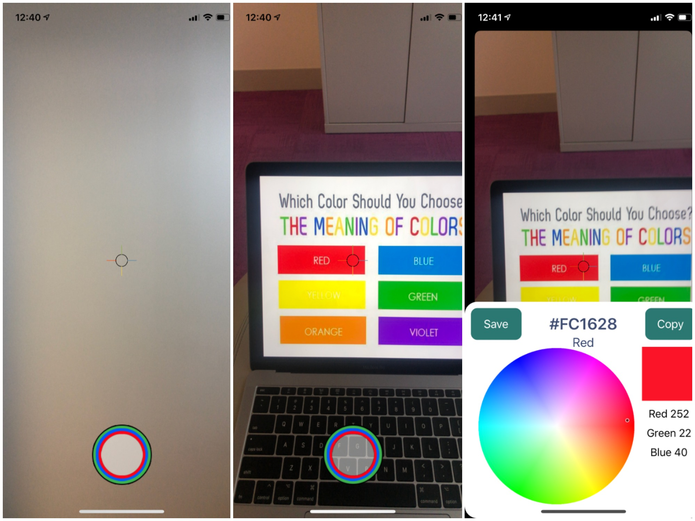

# Color Assistant Application

    <a href="#concept">Concept</a> &bull;
    <a href="#personas">Personas</a> &bull;
    <a href="#appearance">Appearance</a> &bull;
    <a href="#implementations">Implementations</a> &bull;
    <a href="#links">Links</a>

## Concept

### Objective
The difficulties experienced by individuals with colorblindness are often overlooked. My objective is to develop software to help colorblind or visually impaired individuals identify colors in their space, providing  users with these disabilities the liberty to function in a color-centric environment. 
### Relevance
This project is a relevant as it will help the class develop GUI building, object oriented design, and multithreading skills. The application will check the camera for colors, involving multithreading for the detection process to coincide with the camera. 
### Proposed contribution
Unfortunately most of the open source projects semi relevant to my idea (or blatantly the same) are not under the open source license. Even worse, a lot of the code doesn't even work. I do not see this as a roadblock to successfully launching this project. There are many libraries in Swift or JavaScript that could handle color detection i.e. the Swift Framework Accelerate https://developer.apple.com/documentation/accelerate and Javascript’s tracking.js https://trackingjs.com/examples/color_hello_world.html. Our contribution will therefore be starting an open source project to help individuals with color blindness identify color. I’m looking for a team interested in or has had experience working with iOS Mobile App development.
### Product Vision
- I would like to address the needs of the colorblind community by addressing these key areas:
- Aid in the ability for a colorblind person to be able to distinguish between colors through color identification using the camera on a iPhone or iPad
- Aid an individual being able to pick color items from their wardrobe and be assured that they have can identify the color that they are looking for

## Personas
### The Stigma Fighter 
The stigma fighter doesn't want to be embarrassed by others knowing about the color blindness.
Nobody understands the discomfort they feel when asked what color something is.
### The Fashionista 
The fashionista wants to be able to match the clothes they pick to wear however, they are colorblind. 
Sometimes they pick out great outfits to wear but then they go out and are made fun of because their outfit is not matched correctly.
A tool for matching and identifying colors will be very beneficial.
### The Shopper
The shopper wants to go shopping for clothes to wear but they like an article of clothing because they believe it is a certain color.
However, when they go and wear it they are told it is not the color they thought it was and they are embarrassed because that is not the color they thought it was.
### The Worker
The worker needs to be able to see the correct colors in order to complete their jobs or hobbies correctly.
It is important that the worker can submit work their work with certainty that it is done correctly and not only looks nice but is what their intended vision was.
### The Artist
The artist wants to create meaningful and impactful content to captivate their audience.
It can be hard for colorblind artists to differentiate between colors outside the realm of digital art.
An app that can bring a color dropper to real life situations can be a valuable tool for artists.

## Appearance
<h3 align="center">
  
</h3>
<h3 align="center">
  
</h3>

## Implementations
### Implemented
#### Feature Color Identification
Color identification will allow a user to identify what color an object is.
The color assistant application will do so by taking the average RGB values of the object providing a close approximation of what the color is.
### In the works
#### Feature Wardrobe Assistant
Using Color detection, Wardrobe assistant will allow the user to pair articles of clothing that go together.

## Links
### Trello Board
https://trello.com/b/ol7xoT56/final-project-color-assistant
### Color Blind Research
https://www.notion.so/colorassistant/TLDR-on-colorblindness-f1a5eba23c574a759d3ed0115f3124ec
### Download our Beta App on Testflight
https://testflight.apple.com/join/jNoEQu5T

